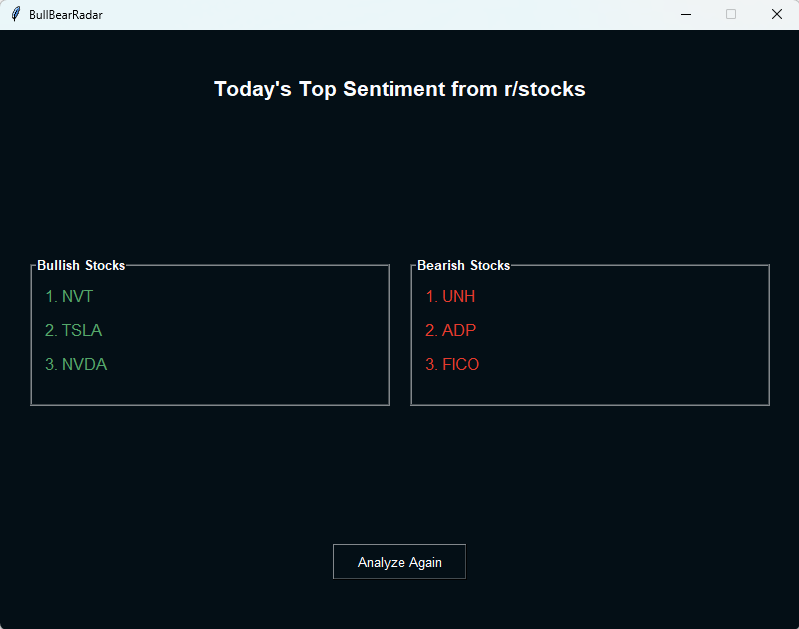
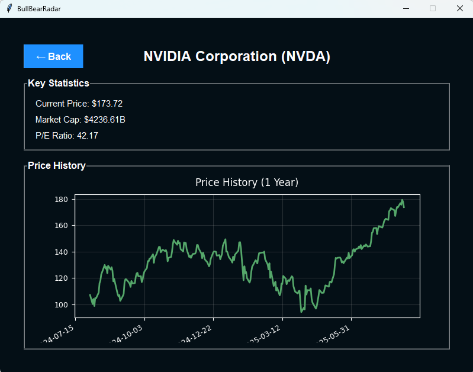

# BullBearRadar

BullBearRadar is a desktop application that automatically scrapes Reddit's r/stocks for trending discussions, analyzes stock mentions at the sentence level for sentiment, and highlights the most bullish and bearish tickers each day. The setup wizard makes installation simple, so anyone can explore daily market sentiment without coding.

## Features

- Easy installation via Setup Wizard (no command line required)
- Web scrapes top daily posts from Reddit's r/stocks subreddit
- Extracts and validates stock tickers using Yahoo Finance
- Performs sentence-based sentiment analysis using VADER to determine positive and negative sentiment
- Fetches real-time and historic stock data for mentioned tickers
- Filters out common English words that might look like tickers

## For End Users

1. Download `BullBearRadar.exe`
2. Run the installer (requires administrator privileges)
3. Follow the installation wizard
4. Enter your Reddit API credentials when prompted
   - You can get these from https://www.reddit.com/prefs/apps
5. Launch the application from the desktop shortcut or Start Menu

## Application screenshots

## Troubleshooting

If you encounter issues during installation:
1. Ensure you have administrator privileges
2. Check your internet connection
3. Temporarily disable antivirus software
4. Run the installer with `/LOG="install.log"` for detailed logs

## License

This project is open source and available under the MIT License.